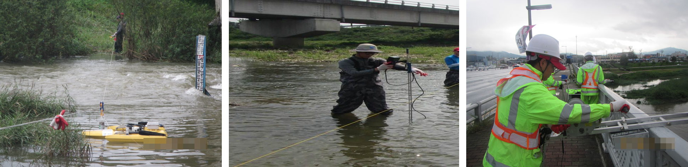
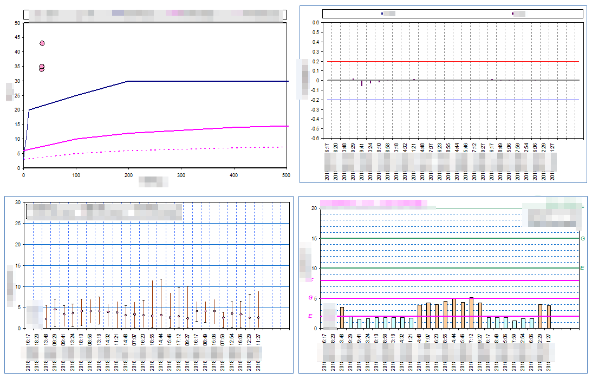
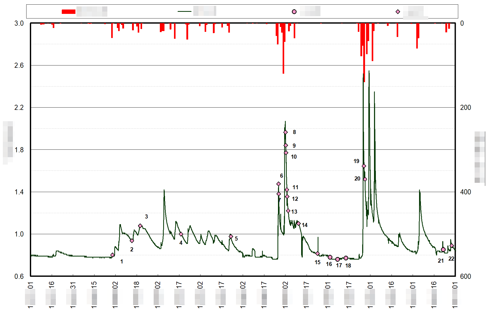
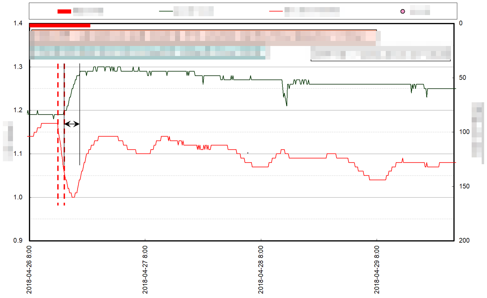
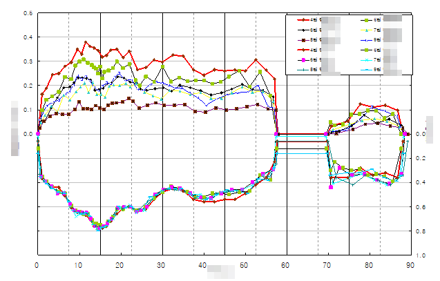
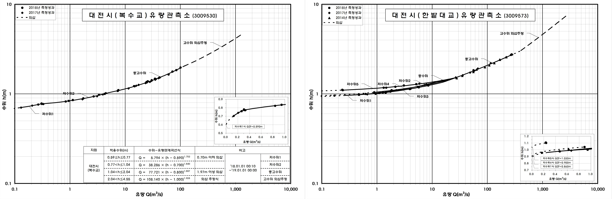
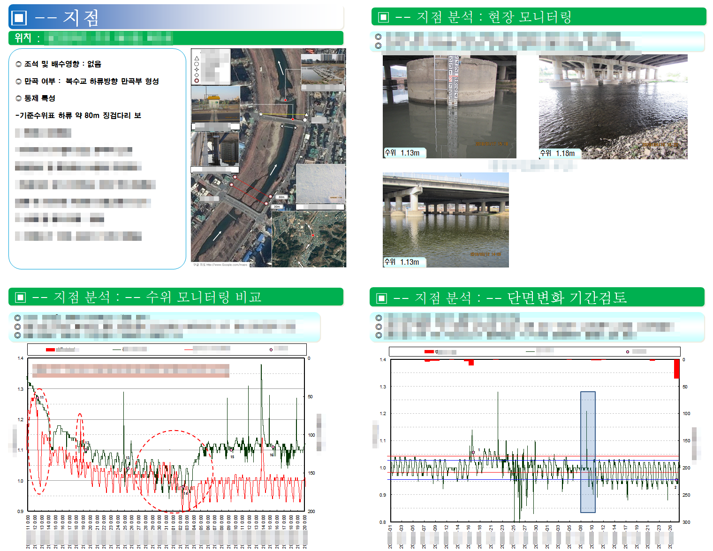
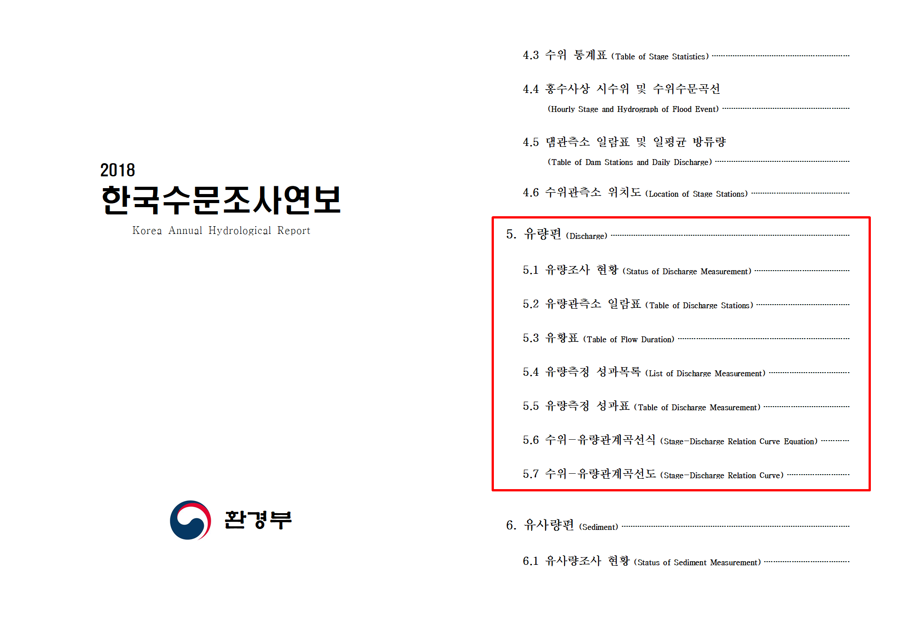

**유량조사**란 **하천에 흐르는 물의 양을 조사하고 분석하는 것**을 뜻하며, 본 포스팅은 수자원의 기초자료인 유량조사 경험을 간략하게 기술하였습니다.

### 유량조사 필요성
- **수자원장기종합계획**에 활용   
- 가뭄피해 예방을 위한 **갈수예보에 활용**   
- **이수 및 치구구조물 설계 시 사용**   
- 오염총량제 등 **수질관리**에 필요   

## 유량측정

유량측정은 정확한 유량 조사를 위해 도플러방식의 **ADV와 ADCP(초음파유속계), 부자** 등 다양한 장비와 방법을 사용하고 있습니다.
수위, 지점특성 등을 종합 고려하여 **가장 안전한** 측정방법을 선택하여 유량측정을 수행합니다.

## 측정성과 분석 및 발표

<figcaption> 분석 예시
</figcaption>

측정성과의 기준을 검토하고, 측량결과, 수위모니터링, 수리적 특성 등 다양한 요소를 분석합니다. 검토 완료된 성과를 사용하여 수위-유량관계곡선식 개발 

<figcaption>ex)  수위-유량관계곡선식
</figcaption>

<figcaption>발표 예시
</figcaption>

안전하고 정확한 자료 산출을 위해 분기 별 발표

|       |            | 
| ----  | ---------- | 
| 1분기 | 담당지점 측정계획, 지점현황 및 특이사항              | 
| 2분기 | 홍수기 일용직 운영 및 안전관리 계획, 측정 시나리오 |
| 3분기 | 측정성과 분석결과               |
| 4분기 | 최종점검        | 

## 보고서 작성

당해년도 분석 결과는 **「수자원의 조사, 계획 및 관리에 관한 법률」**에 의거해 공인 절차 후 **수문조사연보 유량편**에 수록되며, 수위-유량관계곡선식과 보고서 사진은 [한강홍수통제소](http://www.hrfco.go.kr/web/sumun/floodgate.do?year=2018)에서 발췌한 사진입니다. 자세한 보고서 내용은 [한국수자원조사기술원](http://www.kihs.re.kr/index_new.php) 문의 또는 [연세대학교 학술정보원](https://library.yonsei.ac.kr/search/detail/CAT000001978087)에서 열람이 가능합니다.

