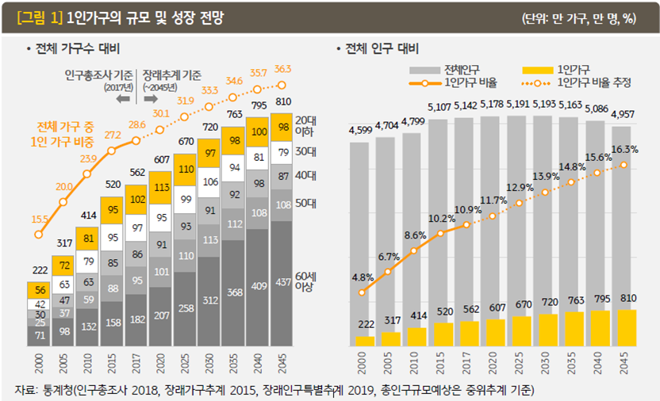
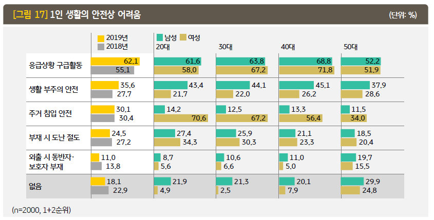
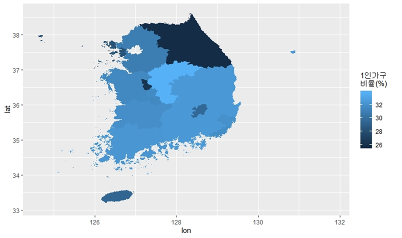
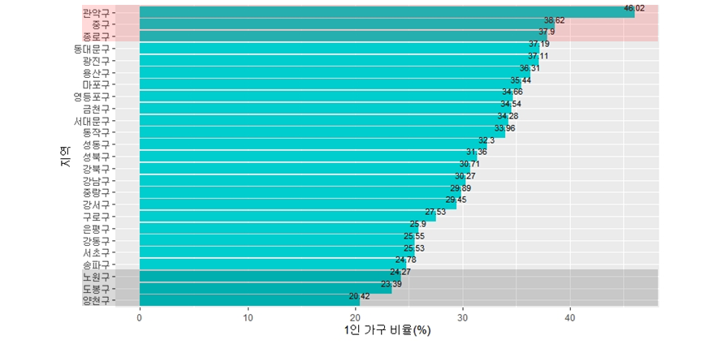
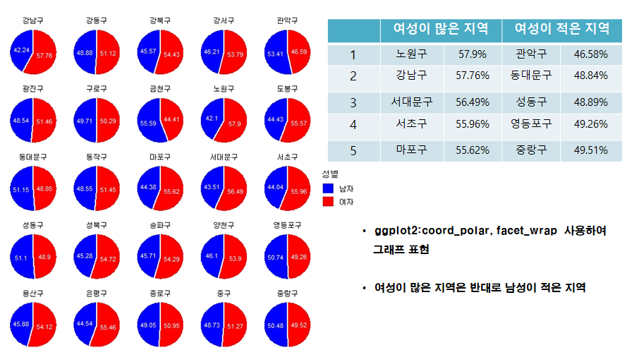
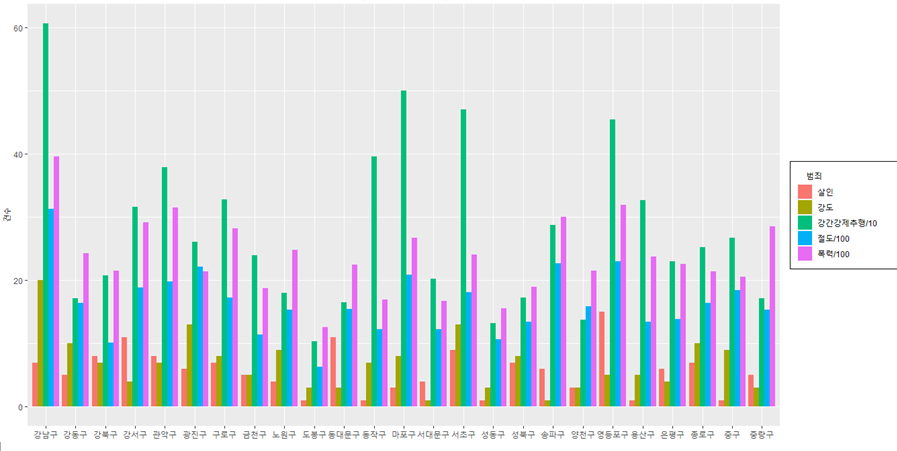

## Smart Home IoT 제품 소개 및 특징

<iframe width="560" height="315" src="https://www.youtube.com/embed/DXyvIlXmIRA" frameborder="0" allow="accelerometer; autoplay; encrypted-media; gyroscope; picture-in-picture" allowfullscreen></iframe>
 

위 영상은 [지금컴퍼니](http://jiguem.com/)에서 서비스하고 있는 **스마트 홈 IoT 서비스 플랫폼** 영상입니다.
**버틀러**란 센서 데이터를 사용하여 가정 내 사용자의 패턴과 성격을 분석하고, **머신러닝과 인공지능 기법**을 통하여 **최적화**된 **고객 맞춤형 환경**을 제공하는 플랫폼 서비스 입니다.

기존 홈 Iot 제품(시리, Google 등)들이 원격 제어 시스템으로 시간과 환경설정을 변경하여 단말을 제어 했다면, **버틀러**는 원격 제어 서비스 뿐만 아니라 **자동 제어 시스템**을 통한 **스마트한 생활 환경** 제공으로 고객 만족도를 높이고 있습니다.

## 주 수요 고객 조사
본 자료는 [2019년 KB경영연구소 보고서](https://www.kbfg.com/kbresearch/report/reportView.do?reportId=1003809)를 참고하여 작성하였습니다.

- 한국의 1인가구 수는 2017년 약 562만 가구이며, **2015년 기점으로 주된 가구 유형**
- 신생아수 감소, 노령화인구 증가, 이혼율 증가 등으로 빠르게 증가
- 2028년 기점으로 총 인구는 감소하지만, **1인가구는 지속적 증가**

- 1인가구 전반적으로 **‘응급상황 대처’**를 가장 큰 어려움으로 꼽음
- 예상치 못한 상황대처가 힘든 1인가구의 특징이 나타남
- 특히 **20,30대 여성 1인가구**는  **주거침입**과 **부재 시 도난 절도**의 관한 걱정이 상당수 차지
- 안전위험에 대한 체감도가 여성이 더욱 높은 것으로 나타남

## Analyst(분석)

<figcaption>ex)  1인가구 비율(전국)
</figcaption>

<figcaption>ex) 1인가구 비율(서울(구))
</figcaption>

<figcaption>ex) 1인가구 남녀비율(서울)
</figcaption>

<figcaption>ex) 범죄현황(서울)
</figcaption>

- 분석 및 시각화 TOOL로는 **R**을 사용(library::ggplot2)
- 공공데이터(인구, 가구, 소득분위, 범죄현황 등)를 사용하여 분석 

## Marketing & Service

1. 1인가구 비율이 높은 서울의 **관악구, 중구, 종로구**를 주요 마케팅 지역으로 선정
2. 실버타운 설립 지역 or 노인인구가 많은 지역에 경우 공기 오염도 및 수면패턴을 분석하여 **‘건강 지킴이 서비스’** 제공 
3. 여성의 비율이 높음 and 강력범죄가 많이 지역에 경우 **'범죄 알림 서비스’** 제공
4. 1인가족 중 남성의 가장 큰 생활상 어려움으로 ‘청소와 음식’문제를 해결하기 위한 **‘음식 추천 서비스’ 및 ‘청결도 알림 서비스’** 제공  

