## PLANNING(기획)
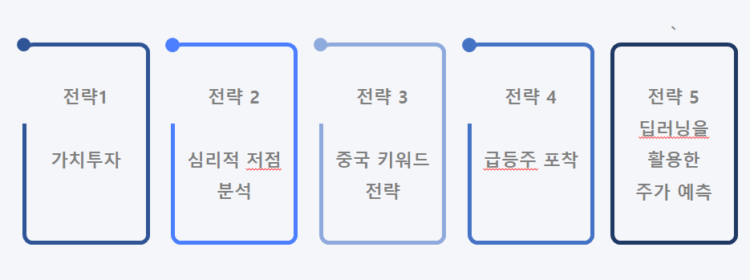

- 국내 및 해외주식을 분석하여 다양한 중기 또는 단기 전략 구성(포트폴리오)
- 다양한 전략을 구성하여 고객 맞춤 추천 서비스 및 자동매매 프로그램 구현 목표 
- 대규모 DATA 분석과 시각화, 자동 매매 프로그램 구현이 가능한 파이썬 사용

|      전략       |    기간            |  내용  |
| --------------- | -------------------- |  ----  |
|       전략1     |    중기              | 재무제표 크롤링 및 악재 검색 알고리즘, 기본적 분석   |
|       전략2     |    중기 OR 단기 | 포괄손익계산서 기반 성장형 우량주 선정, 지지선을 활용한 심리적 저점 알고리즘  |
|       전략3     |    단기              | 중국 웹 사이트 크롤링, 중국 TREND 파악, 중국 관련주 포착   |
|       전략4     |    일 OR 주        | 급등주 포착 알고리즘, 자동 매매프로그램 구현  |
|       전략5     |    -               | 약 2000개 상장 종목의 다음날 주가 예측, 딥러닝, LSTM(Long Shot Term Memory)   |

## DATA 수집
* YAHOO FINANCE 주식 DATA 수집(python::Finance Data Reader 라이브러리)
* [DART](http://dart.fss.or.kr/dsab002/main.do), [네이버금융](https://finance.naver.com/item/main.nhn?code=005930), [중국 사이트](http://www.jrj.com.cn/) 등 웹크롤링(python::selenium 라이브러리)
* 키움 OPEN API를 사용하여 DATA 수집(pycharm)

<figcaption>EX) 중국 웹 크롤링
</figcaption>

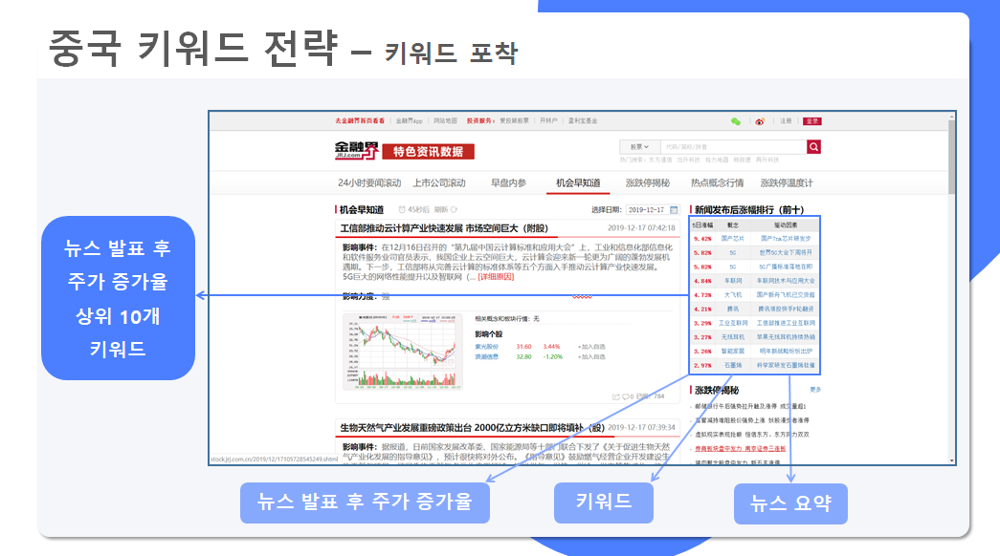

<figcaption>
EX) 네이버금융, DART 웹크롤링
</figcaption>

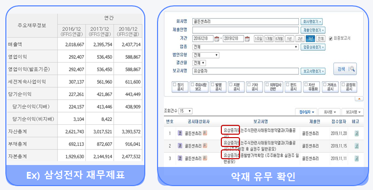
```
pip install selenium
from selenium import webdriver
import time

def BadNews_Finder(CODE):
    badnews = ['유상증자','감자','신주인수권부사채','전환사채','교환사채','불성실', '관리종목', '비적정', '횡령', '배임']
    dart = "http://dart.fss.or.kr/dsab002/main.do"
    driver = webdriver.Chrome("c:/data/chromedriver.exe")
    driver.get(dart)
    time.sleep(2)
    fail = []
    pass_ = []
    for code in CODE:
        driver.find_element_by_id('textCrpNm').clear() # 검색창 빈칸 만들기
        driver.find_element_by_id('textCrpNm').send_keys(code) # 검색창에 종목코드 입력
        driver.find_element_by_xpath('//*[@id="date6"]').click()
        for bn in badnews:
            driver.find_element_by_id('reportName').send_keys(bn) # 상세검색창에 악재 입력
            driver.find_element_by_xpath('//*[@id="searchpng"]').click()
            time.sleep(3)
            # 스크롤링 시작
            req = driver.page_source # 현재 페이지 소스 저장
            soup = BeautifulSoup(req, 'html.parser')
            if (len(soup.select("div .page_list")[0].text.strip()) > 0): #or (len(soup.select("div .page_list")) != 0): # 악재가 검색되면?
                fail.append(code)
            driver.find_element_by_id('reportName').clear()
 return fail

bl = BadNews_Finder(blue_1)
blue = []
for i in blue_1:
    if i not in bl:
        blue.append(i)

blue
```
DART 악재 검색 코드

## DATA 정제
- 수집된 DATA를 PANDAS, NUMPY 등의 라이브러리를 사용하여 전처리 실시

## DATA 분석 및 시각화

<figcaption>전략1 가치투자 분석
</figcaption>

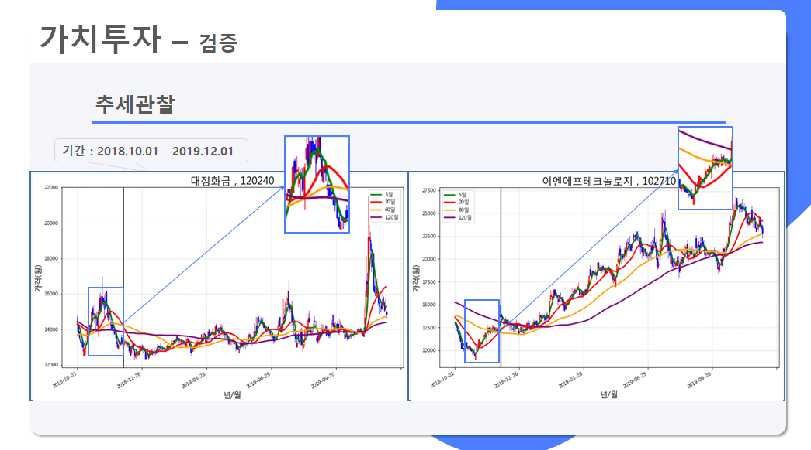

<figcaption>전략2 심리적저점 분석
</figcaption>

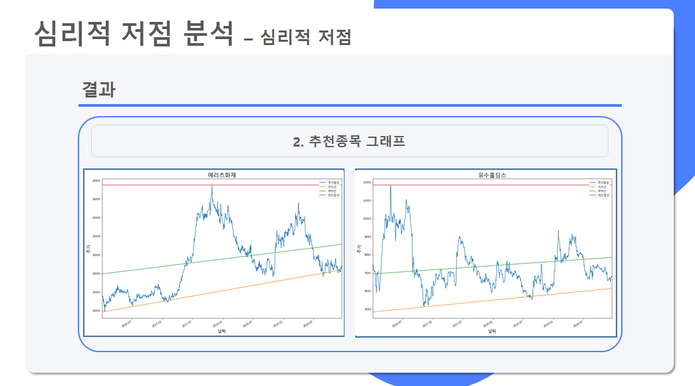


<figcaption>전략3 중국 키워드 분석
</figcaption>

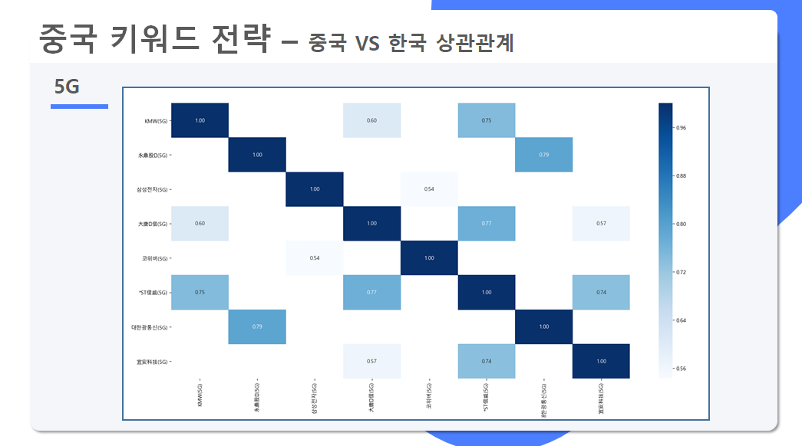

<figcaption>전략5 딥러닝 예측 결과
</figcaption>

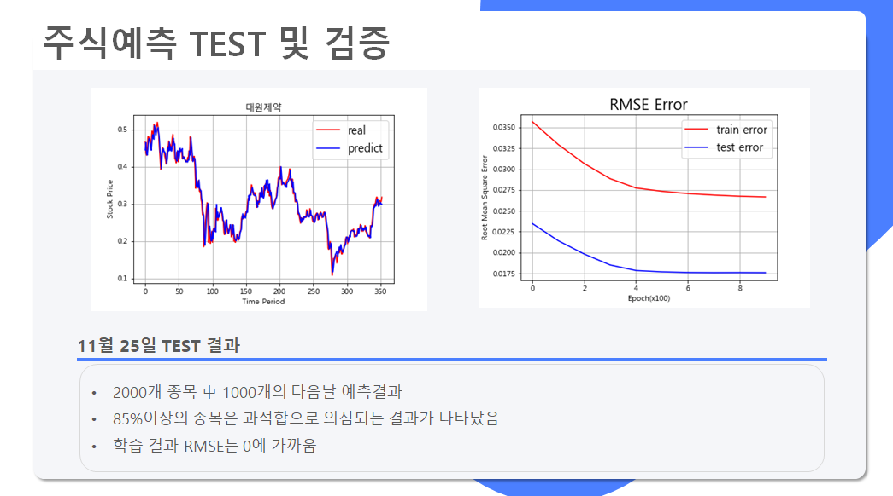

## Strategy Verification(검증)
- 기대수익률과 리스크를 계산하여 전략 검증 및 비교
- 구체적인 전략 별 분석 및 검증 결과는 별도로 포스팅할 예정

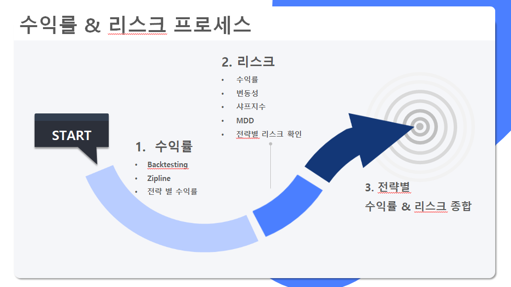

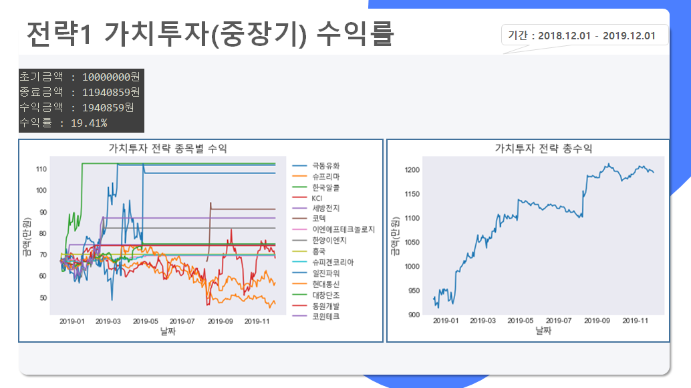

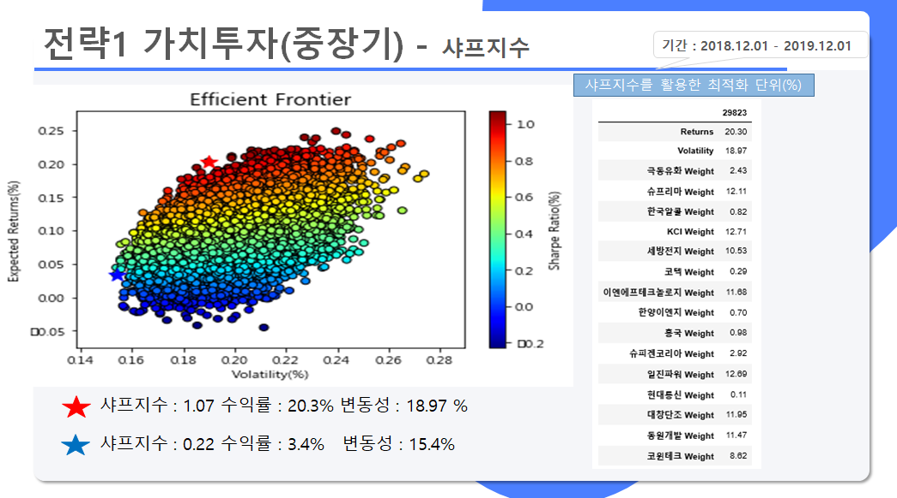

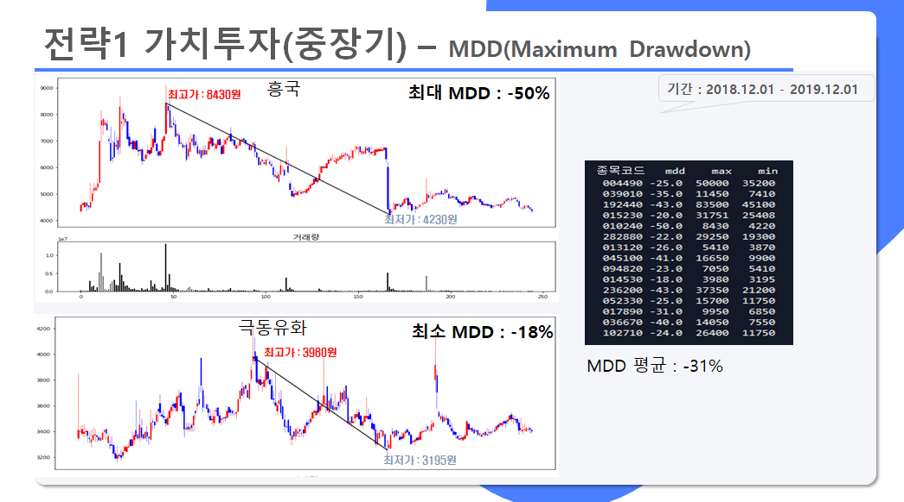


<github url="https://github.com/mhaack/home-assistant-config/tree/master/config/integrations" title="The full list is available on Github"/>