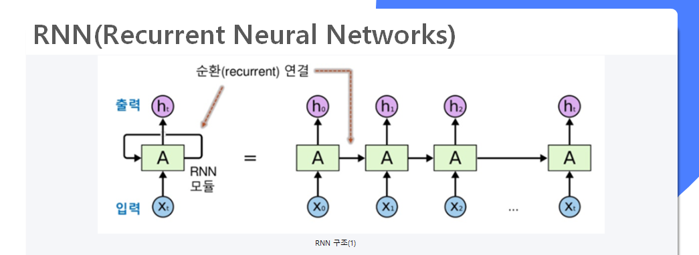
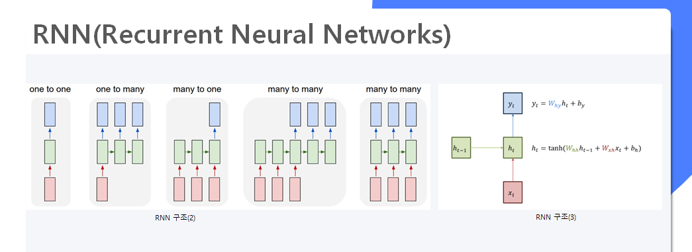
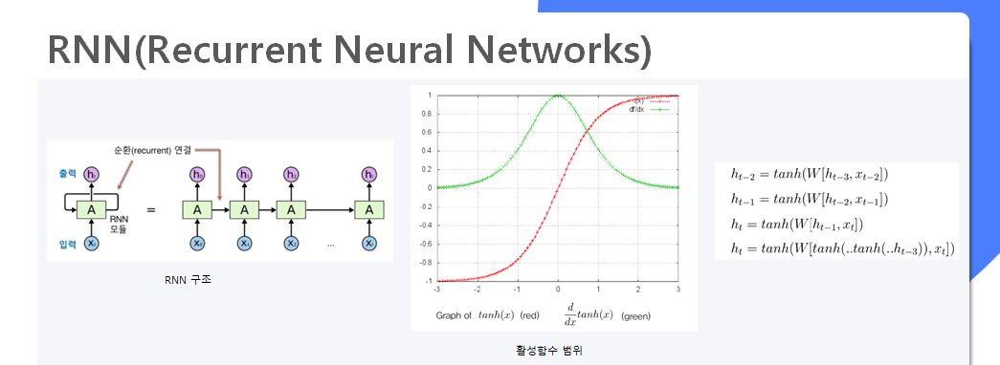
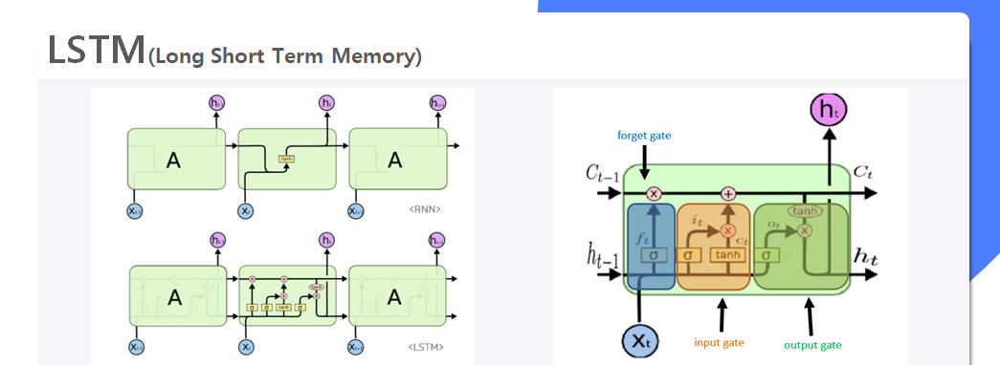
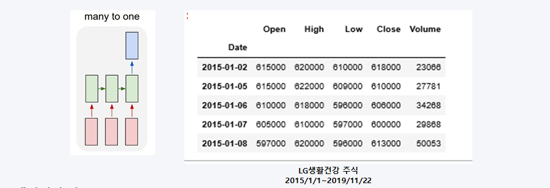
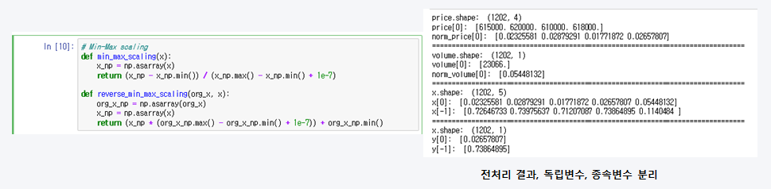
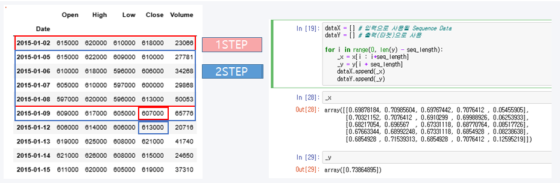
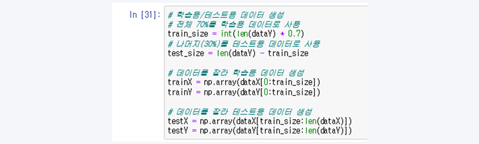
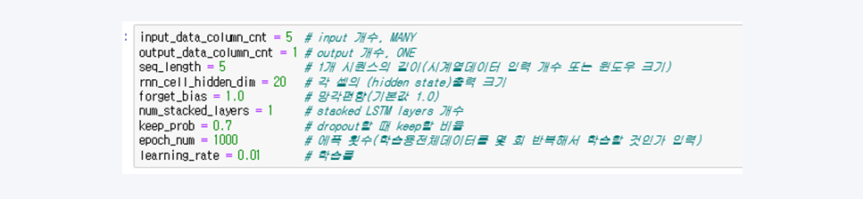
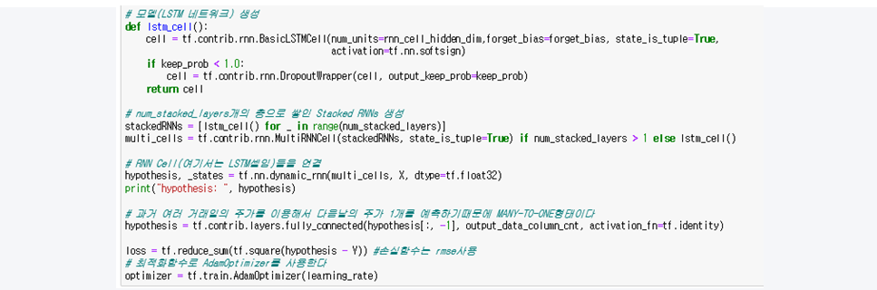

이번 포스팅은 주가 예측으로 사용 된 LSTM 모델에 대한 설명과 RNN의 문제점과 실제 적용 및 결과를 정리한 내용입니다.
위 내용은 미국 스탠포드대학의 CS231n 강좌와 ratsgo's blog를 참고하여 작성하였으며, 자세한 내용을 알고 싶으신 분은 링크 or github를 참고해주시길 바랍니다.

## GOAL(목표)
-	다음날 주가를 예측하는 딥러닝 모델 구축
-	예측된 주가가 오늘(t) 종가보다 5% 이상인 대형주 주식을 매수
-	다음날(t+1) 5%이상 올랐을 시 매도, 5% 이하일 시 보유  

RNN의 기본적인 구조는 위의 그림과 같다.(X : 입력, A : hidden state, h : 출력) 
data입력 시 hidden state(Ht-1)의 결과가 다시 hidden state(Ht)로 연결된 순환 신경망 형태이며, 순서와 시간을 고려한 시계열 데이터에 주로 사용되는 인공신경망입니다.
#### RNN 특징 
- sequence 길이에 관계없이 인풋과 아웃풋을 받아들일 수 있는 네트워크 구조
- 다양하고 유연한 구조로 숫자, 음성, 문자 데이터를 처리하는 모델로 적합함
- Hidden state의 활성함수로는 tanh함수 또는 softsign함수를 사용

#### RNN 문제점 : Vanishing Gradient Problem
정교한 모델링을 구현하기 위해 Hidden state 수를 증가 시킬수록 활성함수가 중첩되어 계산됩니다.
이 때 학습이 진행될수록 Gradient 값이 점차 줄어들면서 학습능력이 크게 저하하는 문제점이 발생합니다. 
(활성함수의 결과값은 -1~1사이의 값으로 1이하의 숫자를 곱 할수록 0에 수렴하는 점을 생각하면 된다.)

#### LSTM이란?
RNN의 문제점을 해결하기 위해 Cell state를 추가하여 Gradient 값을 잘 전달하게끔 만든 모델이며,
각 각의 Cell state는 3개의 gate를 통해 기억/망각을 학습하는 단계입니다.

- Forget gate : 이전의 Hidden state 결과를 얼마나 반영 or 망각 할지 정하는 단계
- Input gate : input으로 들어온 정보를 얼마나 반영할지 정하는 단계
- Output gate : 얼마에 정보를 다음 Hidden state 또는 최종 출력 결과로 정하는 단계 

## LSTM을 활용한 주가 예측 모델 설계
- sample 모델로 'LG생활건강'의 2015~2019년의 주가 데이터 사용
- 시가, 저가, 고가, 종가, 거래량 총 5개의 독립변수를 사용하여 다음날 종가를 예측하는 모델(many to one)
- ppt 자료는 jupyter에서 일부 코드 결과만 캡쳐해서 만들어진 자료이며, 완전한 코드는 github 참고

1.데이터수집   
FinanceDataReader 라이브러리를 사용하여 YAHOO FINANCE의 'LG건강생활' 주가 데이터 수집

2.데이터전처리     
0으로 나누는 오류를 방지하기 위해 별도의 min_max_scaling 함수와 역정규화를 위한 reverse_min_max_scaling함수 생성
거래량은 주식과 범위가 다르기 때문에 별도로 정규화 실시

3.모델 적용을 위한 window 생성   
LSTM 모델을 적용하기 위해선 seq_length를 설정 필요(window 생성)  
Window크기로 shape을 바꾸기 위해 array형식으로 변환   
step1은 5일 동안 5개의 독립변수(5x5)를 사용해서 다음날 close를 예측하는 모델   
다음과 같은 방식을 끝까지 마지막 close를 예측 할때까지 수행   

4.Train : Test 7:3 비율로 분리   

5.하이퍼파라미터 설정   
과적합(over fitting)을 방지하기 위해 dropout = 0.3으로 설정   
1000번 시행, learning rate는 0.01로 설정   

6.모델 생성   
활성함수 : softsign함수   
손실함수 : RMSE(Root Mean Square Error)   
최적화함수 : AdamOptimizer   

7.적용결과   

## 테스트

---
>가나다라
>>1234
>>>오맫갸ㅓㅐ
---
RNN의 문제점을 해결하기 위해 Cell state를 추가하여 Gradient 값을 잘 전달하게끔 만든 모델이며,
각 각의 Cell state는 3개의 gate를 통해 기억/망각을 학습하는 단계입니다.
---
>RNN의 문제점을 해결하기 위해 Cell state를 추가하여 Gradient 값을 잘 전달하게끔 만든 모델이며,
>>각 각의 Cell state는 3개의 gate를 통해 기억/망각을 학습하는 단계입니다.
>>>RNN의 문제점을 해결하기 위해 Cell state를 추가하여 Gradient 값을 잘 전달하게끔 만든 모델이며,
---
`RNN`의 `문제점을 해결`하기
---
아자차카

