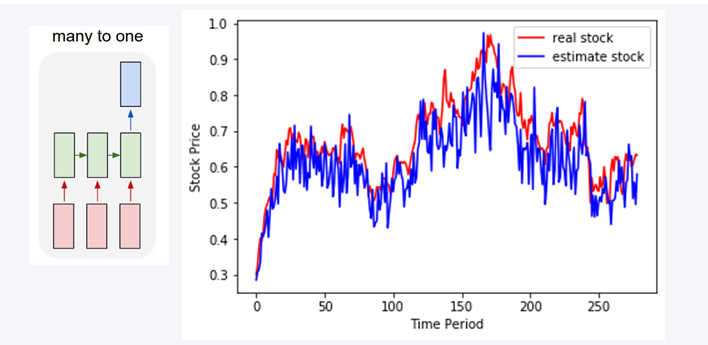
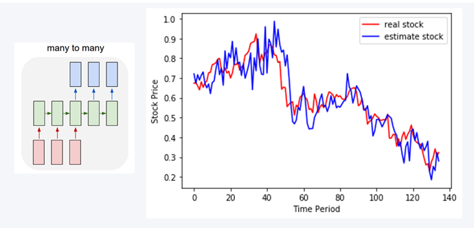
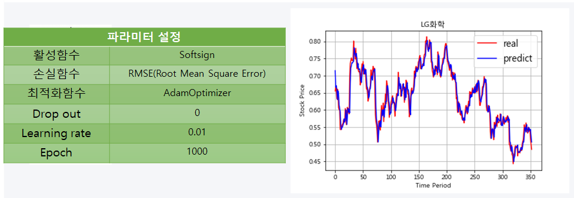
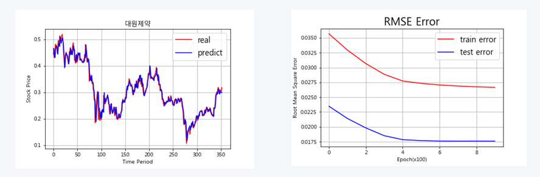
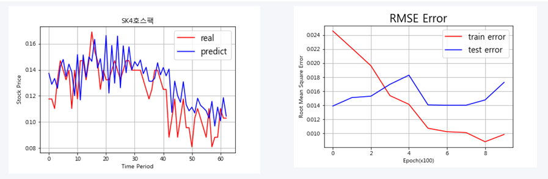
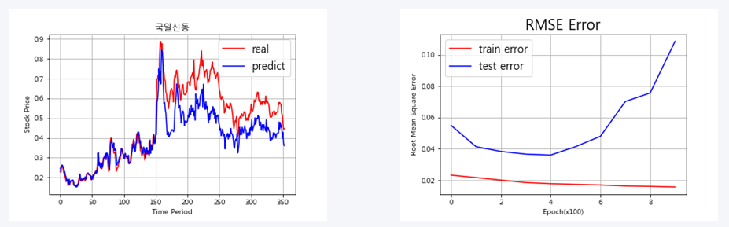
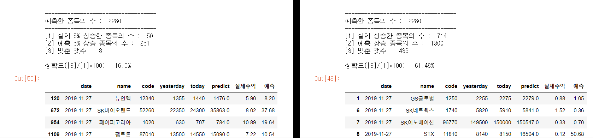

이번 포스팅은 파이썬을 활용한 포트폴리오 중 **'전략5 딥러닝을 활용한 주가 예측 모델 설계 및 적용'**에 관한 내용입니다.
주가 예측으로 사용 된 LSTM(Long Short-Term Memory model) 설명과 RNN(Recurrent Neural Networks)의 문제점, 실제 적용 결과를 정리하였으며, [ratsgo's blog](https://ratsgo.github.io/natural%20language%20processing/2017/03/09/rnnlstm/)를 참고하여 작성하였습니다.

## GOAL(목표)
-	**다음날 주가를 예측하는 딥러닝 모델 구현**
-	예측된 주가가 오늘(t) 종가보다 **5% 이상인 대형주 주식을 매수**
-	다음날(t+1) **5% 이상 올랐을 시 매도, 5% 이하일 시 보유** 

**RNN(Recurrent Neural Networks)**의 기본적인 구조는 위의 그림과 같습니다.   
data입력 시 hidden state(Ht-1)의 결과가 다시 hidden state(Ht)로 연결된 **순환 신경망 형태**이며, **순서와 시간을 고려한 시계열 데이터에 주로 사용되는 인공신경망**입니다.
### RNN 특징 
- **시퀀스 길이와 관계없이 인풋과 아웃풋을 받아들일 수 있는 네트워크 구조**
- 다양하고 유연한 구조로 **숫자, 음성, 문자 데이터를 처리하는 모델로 적합**
- Hidden state의 활성함수로는 **tanh함수** 또는 **softsign함수**를 사용
 

### RNN 문제점 : Vanishing Gradient Problem
정교한 모델링을 구현하기 위해 **Hidden state 수를 증가 시킬수록 활성함수가 중첩되어 계산**됩니다.
이 때 학습이 진행될수록 Gradient 값이 점차 줄어들면서 **학습 능력이 크게 저하**하는 문제점이 발생합니다. 
(활성함수의 결과값은 -1~1사이의 값으로 1 이하의 숫자를 곱 할수록 0에 수렴)
 

### LSTM(Long Short-Term Memory model)이란?
RNN의 문제점을 해결하기 위해 **Cell state를 추가**하여 Gradient 값을 잘 전달하게끔 만든 모델이며,
각 각의 Cell state는 **3개의 gate를 통해 기억/망각을 학습하는 단계**입니다.

- **Forget gate** : 이전의 Hidden state 결과를 얼마나 반영 or 망각 할지 정하는 단계
- **Input gate** : input으로 들어온 정보를 얼마나 반영할지 정하는 단계
- **Output gate** : 얼마에 정보를 다음 Hidden state 또는 최종 출력 결과로 정하는 단계 
 

## LSTM을 활용한 주가 예측 모델
- **'LG생활건강'**의 2015~2019년의 주가 데이터 사용
- 5일 동안 **5개(시가, 저가, 고가, 종가, 거래량)의 독립변수**를 사용하여 **다음날 종가**를 예측하는 모델(many to one)
- Python의 **Tensorflow** 사용

<github url="https://github.com/yoojun003/stock_project/blob/master/Strategy5_lstm/example/LSTM_tensor_example.py" title="LSTM-sample-code is available on Github"/>

## 모델 해석

<figcaption>MODEL-1
</figcaption>

1. 연속적인 시계열 데이터가 dropout 설정으로 random하게 바뀌면서 정확한 예측을 하지 못함(dropout = 0.3)
2. 실제 주가의 추세보다 변동이 크게 나타남

<figcaption>MODEL-2(many to many)
</figcaption>

1. 28일 5개의 독립변수를 사용하여 3일(T+3)에 종가를 예측하는 모델
2. 데이터 양을 증가시켜 학습 했음에도 정확한 예측을 하지 못함(10년)

<figcaption>MODEL-3(many to one)
</figcaption>

1. 28일 5개의 독립변수를 사용하여 다음날 종가를 예측하는 모델로 최종 결정 
2. 파라미터 조정 결과 위 표와 같이 설정함 
3. **과적합(Over fitting)**과 **전날 종가의 영향을 많이 받는 모델**로 유추됨

## 실제 모델 적용

### 적용 방법
- 데이터 : 2015.01.01 ~ 2019.11.22(5년)
- 적용 기간 : 2019.11.25 ~ 2019.12.03(6일)
- 현재 상장된 약 2000개 종목의 다음날 종가 예측
- 시각화 자료, RMSE, 수치를 활용한 분석

## 결론

<figcaption>정분류
</figcaption>

<figcaption>오분류
</figcaption>

- 약 **80%** 종목에서 정확한 예측 결과가 나타남(단, 과적합 의심)
- 최근 상장된 종목에 경우 **학습 데이터 부족**으로 오분류
- **변동**이 심한 일부 종목에서 오분류가 나타남

<figcaption>ex) 2019.11.27 예측 결과
</figcaption>

- 다음날 **5% 이상 오르는 종목**의 수는 극히 드물기 때문에 **정확도는 16%**로 낮음 
- 단, 다음날 **상승** 예측에 관한 정확도는 **약 60%**로 높게 나타남 
- **수익률 조정, 오분류 결과 등 불확실한 예측 결과를 정제** 한다면 정확도는 **상승** 할 것으로 판단
- 예측 결과로만 투자하기엔 리스크가 크지만, **매수 이전에 보조지표로 활용 가능할 것으로 판단**