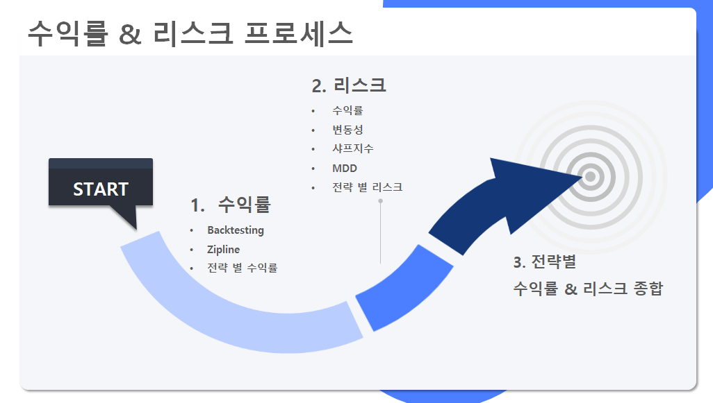
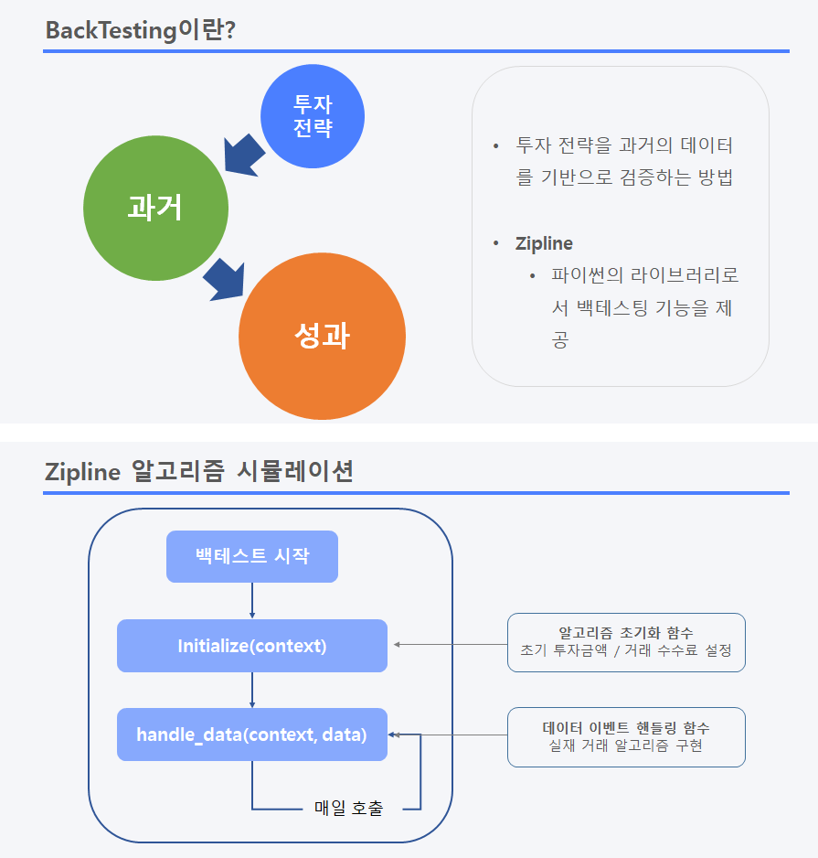
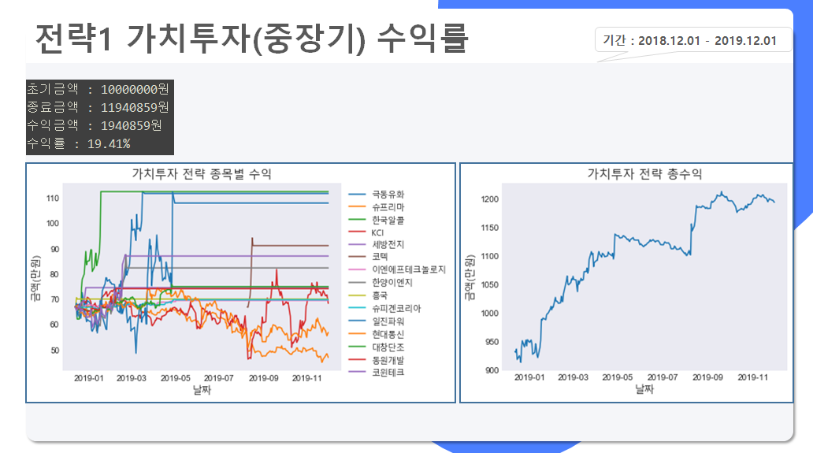
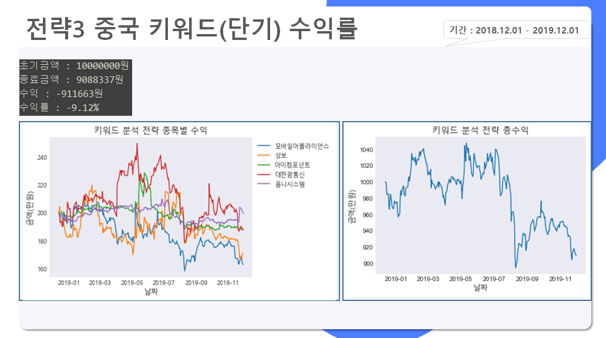
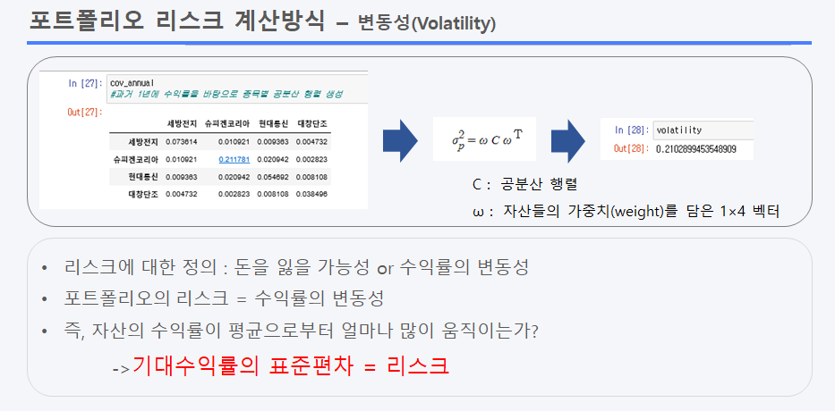
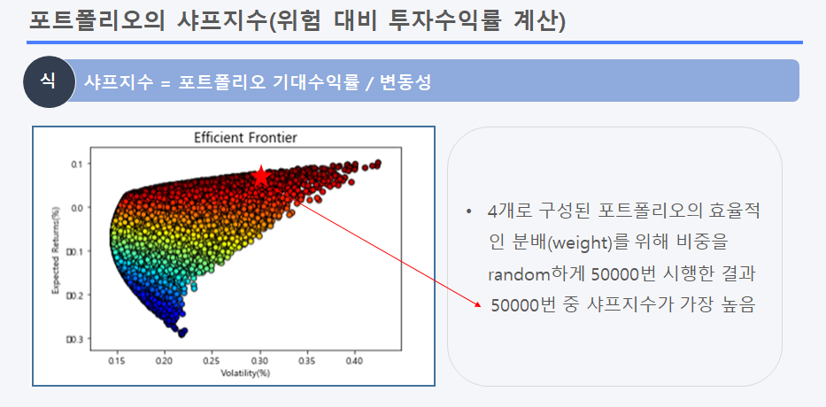
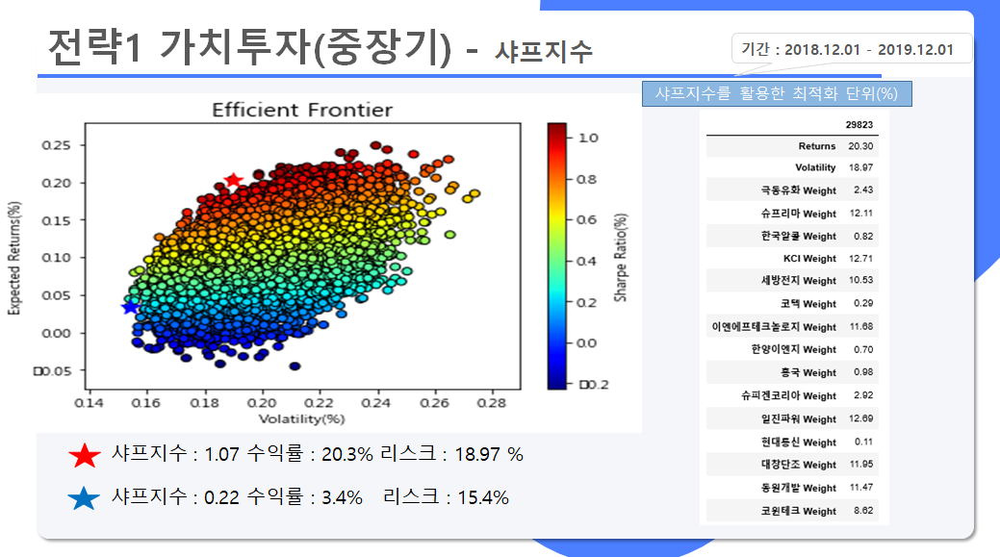
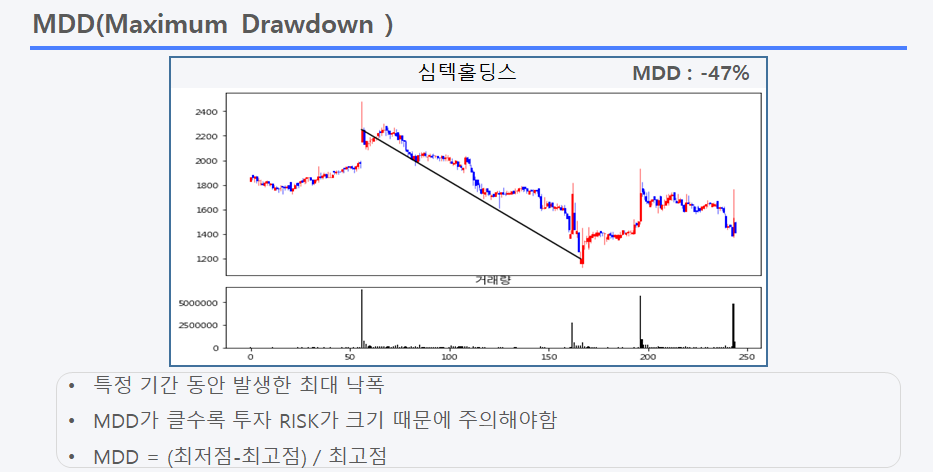
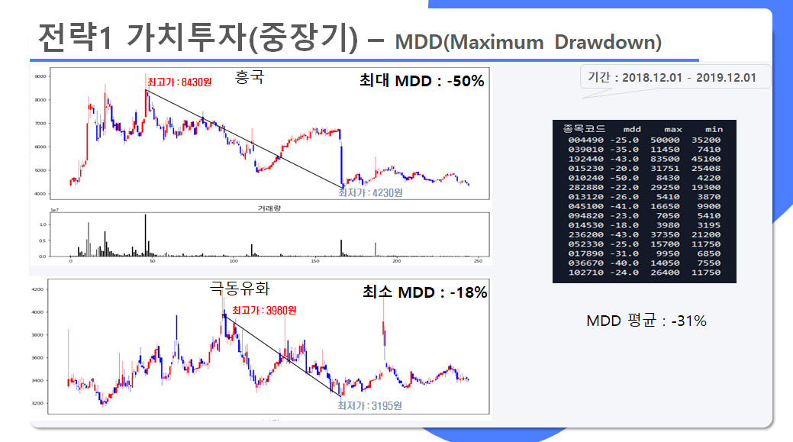
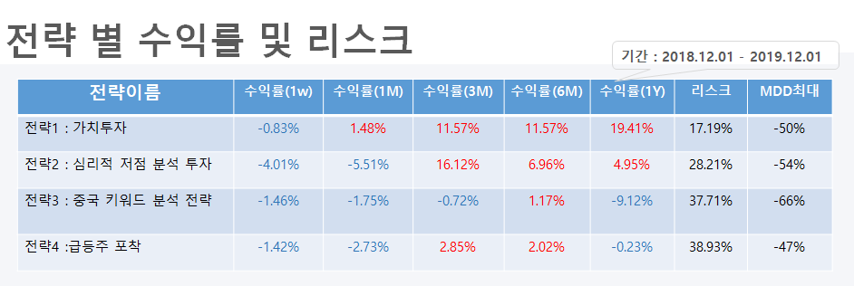

이번 포스팅은 파이썬을 활용한 포트폴리오 중 **'수익률과 리스크'**에 관한 내용입니다.   
앞서 소개된 전략 중 '딥러닝을 활용한 주가 예측'을 제외한 **4개의 전략 별 기대수익률과 리스크**를 계산하여, **고객 성향 별 전략 추천** 또는 **안전한 투자 전략을 선택**할 수 있습니다.

## 1. 수익률(return)

- **백테스팅**이란 **투자 전략을 과거의 주가 데이터를 기반으로 검증**하는 방법
- Python의 **Zipline**을 사용하여 백테스팅 시행, 시각화는 **matplotlib** 사용
- **검증 기간 : 2018.12.01 ~ 2019.12.01**
- 투자 금액은 **천만원**으로 설정

<figcaption>예시 1
</figcaption>

<figcaption>예시 2
</figcaption>

<github url="https://github.com/yoojun003/stock_project/tree/master/return" title="The return_code is available on Github"/>

## 2. 리스크(RISK)

- 검증 기간은 **수익률과 동일한 기간 적용**
- 전략 별 **리스크(RISK)** 및 **최대 낙폭(Maximum Drawn Down)** 계산
- **샤프지수(Sharp ratio)**를 활용한 **최적화** 
- 시각화는 파이썬의 **matplotlib, mpl_finance** 사용 

<figcaption>샤프지수 계산방법
</figcaption>

<figcaption>최적화 예시
</figcaption>

<figcaption>최대 낙폭 계산방법
</figcaption>

<figcaption>최대 낙폭 예시
</figcaption>

<github url="https://github.com/yoojun003/stock_project/tree/master/risk" title="The risk_code is available on Github"/>

## 3. 종합

