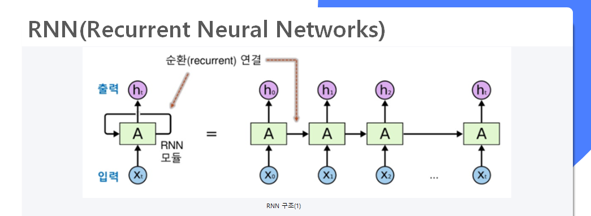
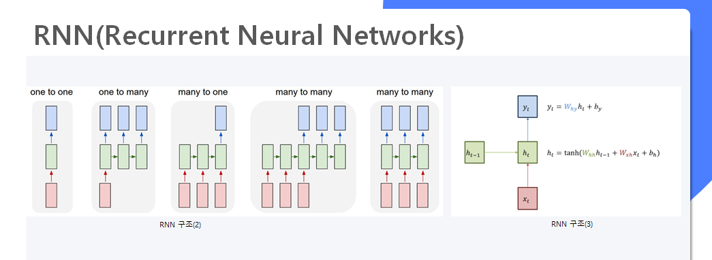
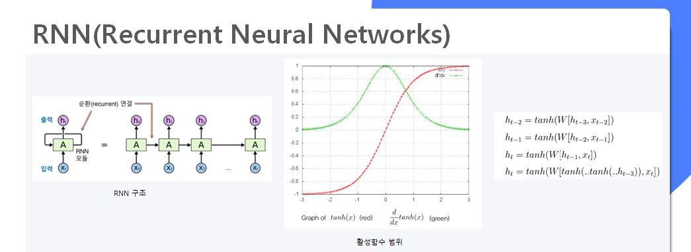
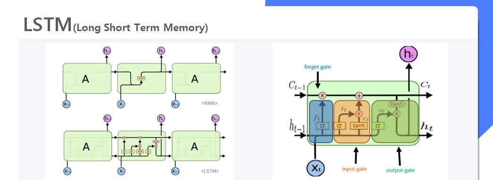

이번 포스팅은 주가 예측으로 사용 된 LSTM 모델에 대한 설명과 RNN의 문제점과 실제 적용 및 결과를 정리한 내용입니다.
위 내용은 미국 스탠포드대학의 CS231n 강좌와 ratsgo's blog를 참고하여 작성하였으며, 자세한 내용을 알고 싶으신 분은 링크 or github를 참고해주시길 바랍니다.

## GOAL(목표)
-	다음날 주가를 예측하는 딥러닝 모델 구축
-	예측된 주가가 오늘(t) 종가보다 5% 이상인 대형주 주식을 매수
-	다음날(t+1) 5%이상 올랐을 시 매도, 5% 이하일 시 보유  




RNN의 기본적인 구조는 위의 그림과 같다.(X : 입력, A : hidden state, h : 출력)<br/>
data입력 시 hidden state(Ht-1)의 결과가 다시 hidden state(Ht)로 연결된 순환 신경망 형태이며, 순서와 시간을 고려한 시계열 데이터에 주로 사용되는 인공신경망이다.
#### RNN 특징 
- sequence 길이에 관계없이 인풋과 아웃풋을 받아들일 수 있는 네트워크 구조
- 다양하고 유연한 구조로 숫자, 음성, 문자 데이터를 처리하는 모델로 적합함
- Hidden state의 활성함수로는 tanh함수 또는 softsign함수를 사용


#### RNN 문제점 : Vanishing Gradient Problem
정교한 모델링을 구현하기 위해 Hidden state 수를 증가 시킬수록 활성함수가 중첩되어 계산된다.
이 때 학습이 진행될수록 Gradient 값이 점차 줄어들면서 학습능력이 크게 저하하는 문제점이 발생한다. 
(활성함수의 결과값은 0~1사이의 값으로 1이하의 숫자를 곱 할수록 0에 수렴하는 점을 생각하면 된다.)


#### LSTM이란?
RNN의 문제점을 해결하기 위해 Cell state를 추가하여 Gradient 값을 잘 전달하게끔 만든 모델이며,
각 각의 Cell state는 3개의 gate를 통해 기억/망각을 학습하는 단계이다.

- Forget gate : 이전의 Hidden state 결과를 얼마나 반영 or 망각 할지 정하는 단계
- Input gate : input으로 들어온 정보를 얼마나 반영할지 정하는 단계
- Output gate : 얼마에 정보를 다음 Hidden state 또는 최종 출력 결과로 정하는 단계 

## LSTM을 활용한 주가 예측 모델 설계
1. 데이터수집
```python
code = '051900' #종목코드 입력
start_date = '2015-01-01' #시작일
end_date = '2019-11-22' #종료일
validation_date = '2019-11-29'#19/11/25~11/29일 검증 기간
#종목 이름 가져오기
name_list = fdr.StockListing('KRX')
name_list = name_list.loc[:,['Symbol','Name']]
sample = pd.DataFrame(columns = ['Symbol','Name'])
k = 0
for i in range(len(name_list)):
    if name_list.iloc[i,0] in code:
        sample.at[k,'Symbol'] = name_list.iloc[i,0]
        sample.at[k,'Name'] = name_list.iloc[i,1]
        k += 1
stock_name = [i for i in sample['Name']] #종목 이름
raw_dataframe = fdr.DataReader(code,start_date,end_date) 
val_df = fdr.DataReader(code,end_date,validation_date) 
raw_dataframe  = raw_dataframe[['Open','High','Low','Close','Volume']]
stock_info = raw_dataframe.values.astype(np.float) 
print("stock_info.shape: ", stock_info.shape)
print("stock_info[0]: ", stock_info[0])
```
2. 데이터전처리
3. 학습 데이터, 테스트 데이터 분리
4. 파라미터 설정
5. 모델 생성


<div id ="footnotes-p">각주입니다<sup>[1](#footnotes)</sup></div>
<div id ="footnotes">[1](#footnotes-p) 각주 설명  : 설명설명</div>

