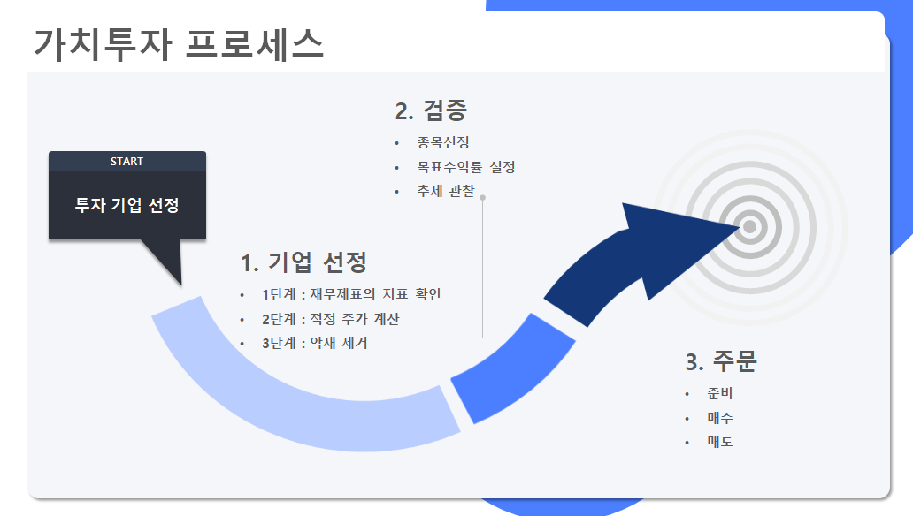
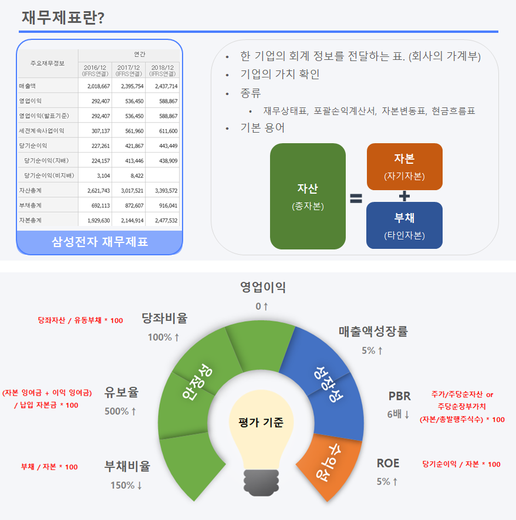
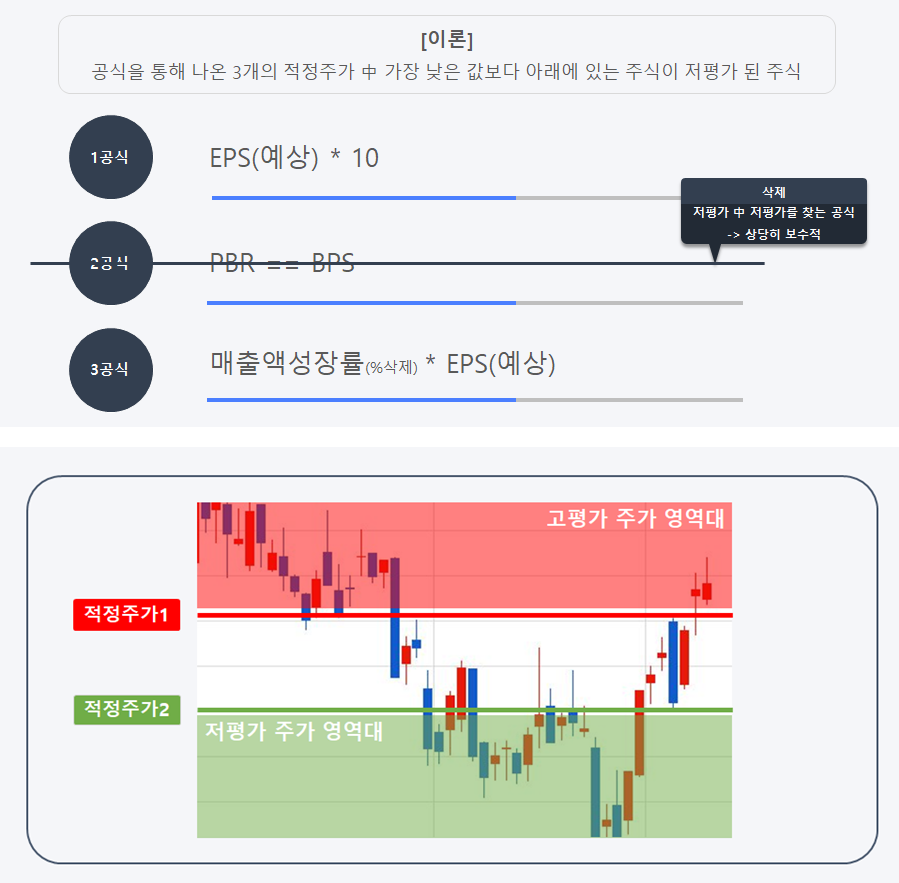
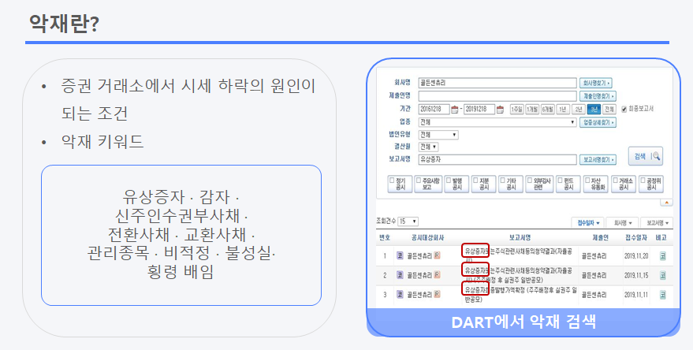
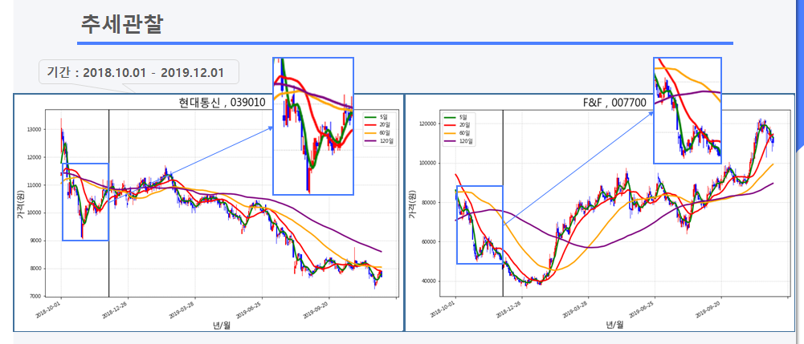
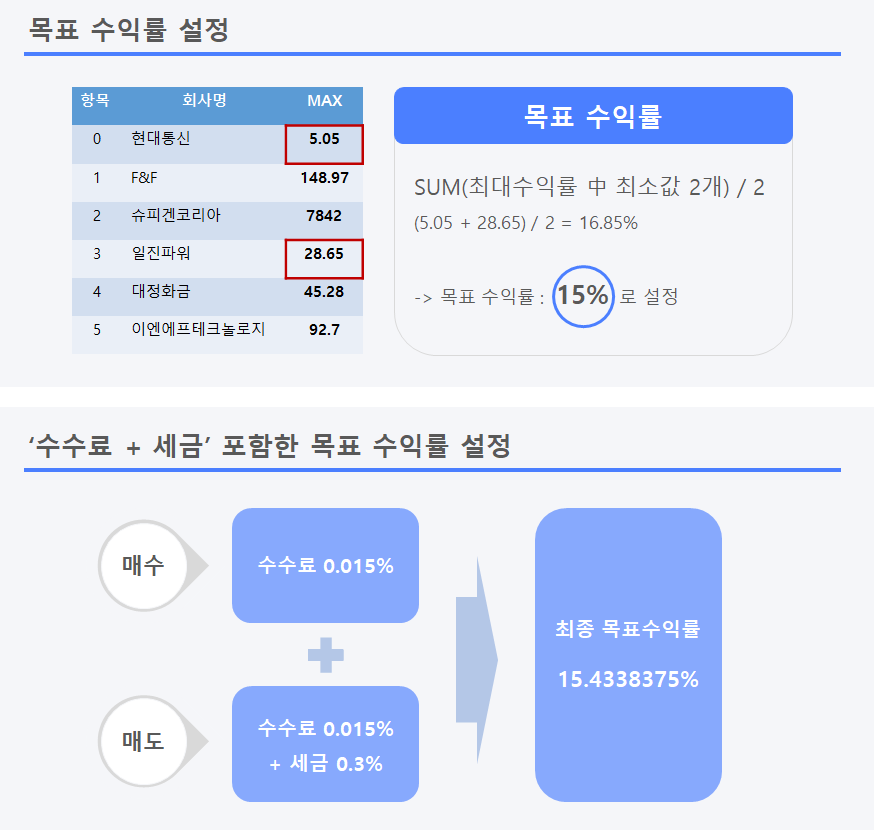
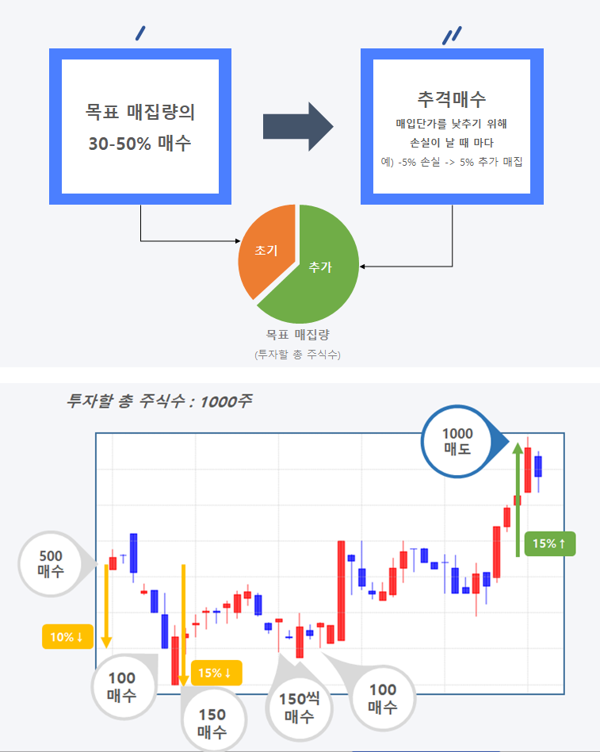
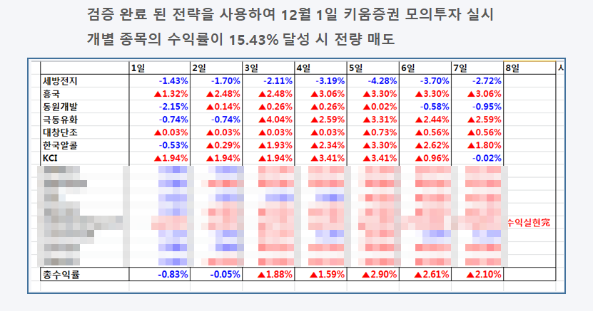

이번 포스팅은 파이썬을 활용한 포트폴리오 중 **'전략1 가치투자'**에 관한 내용입니다.   
재무제표를 활용하여 **기업의 내재적인 가치**를 파악하고, 차트 추세,이동평균선, 뉴스 등 **기술적 분석**을 종합하여 **리스크를 최소화하는 중기 투자 전략**입니다.

## 기업 선정(3단계)

<figcaption>1단계 재무제표 지표 확인
</figcaption>

- [네이버금융 재무제표](https://finance.naver.com/item/main.nhn?code=005930) 웹 크롤링하여 데이터 수집**(Python::selenium)**
- 기업의 가치를 판단하는 **7개의 평가 기준**에 부합하는 기업 선정

<figcaption>2단계 적정주가 계산
</figcaption>

- 1단계를 거친 후 **저평가주** 선정

<figcaption>3단계 악재 제거
</figcaption>

- 마지막으로 [DART](http://dart.fss.or.kr/dsab002/main.do)에서 **'악재 키워드'**가 존재하는 기업 제외 **(Python::selenium)**

## Strategy Verification(전략 검증)

- 최종 선정된 종목들의 주가 데이터를 수집하여 전략 검증 **(Python::FinanceDataReader)**
- **검증 기간** :  **2018.10.01 ~ 2019.12.01(약 1년)**

- **추세, 이동평균선 시각화(Python::matplotlib)**

<figcaption>수익률
</figcaption>

<figcaption>매수 & 매도 방법
</figcaption>

## 모의투자 결과

<github url="https://github.com/yoojun003/stock_project/tree/master/Strategy1__value" title="The full list is available on Github"/>

